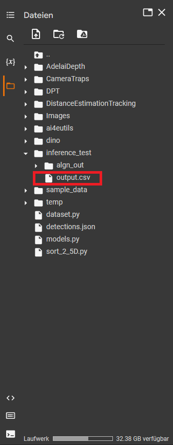

## Table of contents

1. [Overview](#Distance-Estimation-and-Tracking-for-Wildlife-Camera-Trapping)
2. [Instructions](#Instructions)
3. [Examplary Input and Output](#Examplary-Input-and-Output)

## Overview: Distance Estimation and Tracking for Wildlife Camera Trapping
This repository contains the source code of the paper "Distance Estimation and Animal Tracking for Wildlife Camera Trapping", Peter Johanns, Timm Haucke, Volker Steinhage [arXiv paper](https://arxiv.org/abs/2202.04613)

In wildlife density estimation the analysis of camera trap videos is essential for many procedures and often involves labourious, manual analysis.

Most density estimation models require the recognition of an animal in a captured video and its distance in meters to the camera. Some even require an approximation of its movement speed. In practice, combinations of pre-recorded reference videos, additional sensors and manual annotation are used to retrieve this information. 

We propose a fully automatic approach that only requires the camera trap video and the width of the Field Of View (FOV) in degrees of the used device. Our approach recognizes animals, calculates their distance to the camera and tracks animals across the complete video, completely automatic.

For an input video our pipeline outputs per frame the position of all visible animals in the current img, their distances to the camera in meters and the 3D position relative to the camera (x, y, z) with the camera at the center of the coordinate system. The output is saved into a csv file like [this one](S01_output/output.csv) and can be used for further processing with tabulary tools like Microsoft Excel or LibreOffice Calc, if desired.  

## Instructions
We provide the possibility to try out the pipeline by yourself on an examplary input video (S01) seen below. The input image is split into single frames and stored [here](S01_color.zip)

You can use this [Colab notebook](https://github.com/PJ-cs/DistanceEstimationTracking/blob/main/DemoDistanceEstimationTracking.ipynb)  

1. Open the Colab Notebook (a Google account is required)  

2. Click all the "Play" buttons at the upper left corner of each cell from top to bottom.

   - Colab will now install all required libraries and apply the pipeline to the input video
   - This process will take some time (~20 min) due to the installation
   - Colab will notify you, if the process is completed

3. You can find the output .csv file at the left file explorer menu under the folder inference_test/output.csv or if you can't wait that long, [here](S01_output/output.csv).

## Examplary Input and Output
S01, input video for pipeline

Pipeline output, visualized by projecting the tracks back to 3D.

https://user-images.githubusercontent.com/43538742/162448834-e929763d-ffa1-410d-ac43-eac2f511cbbe.mp4

